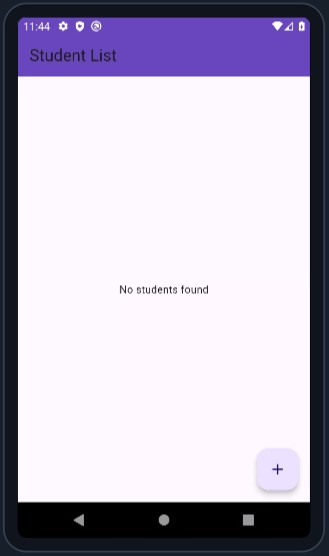
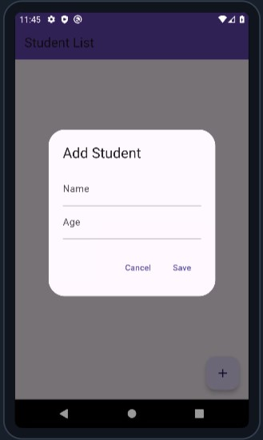
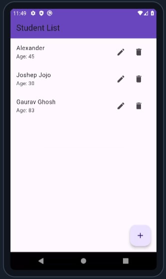
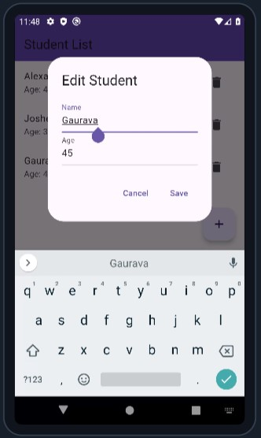

# Student CRUD App with Flutter and SQLite

This Flutter application demonstrates a simple CRUD (Create, Read, Update, Delete) functionality using SQFLite for managing a list of students.

## Features

- Add a new student
- View a list of students
- Update student details
- Delete a student

## Screenshots

|  |   | |   |
| -------------------------- | -------------------------- | -------------------------- | -------------------------- |

## Getting Started

### Prerequisites

Flutter installed on your development machine. You can follow the official Flutter installation guide if you don't have Flutter installed.
Basic knowledge of Dart and Flutter.

### Setup Instructions

1. Clone the Repository
   
     ```
       git clone <repository-url>
       cd crud-sqflite
     ```
3. Install Dependencies
   
     ```
       flutter pub get
     ```
### Running the App

1. Run the app
   
   ```
   flutter run
   ```
### Using the App

- Add a Student: Click the "+" button and fill in the student details.
- Edit a Student: Click the "edit" icon next to a student's name.
- Delete a Student: Click the "delete" icon next to a student's name.
- View Students: The main screen displays the list of students.
